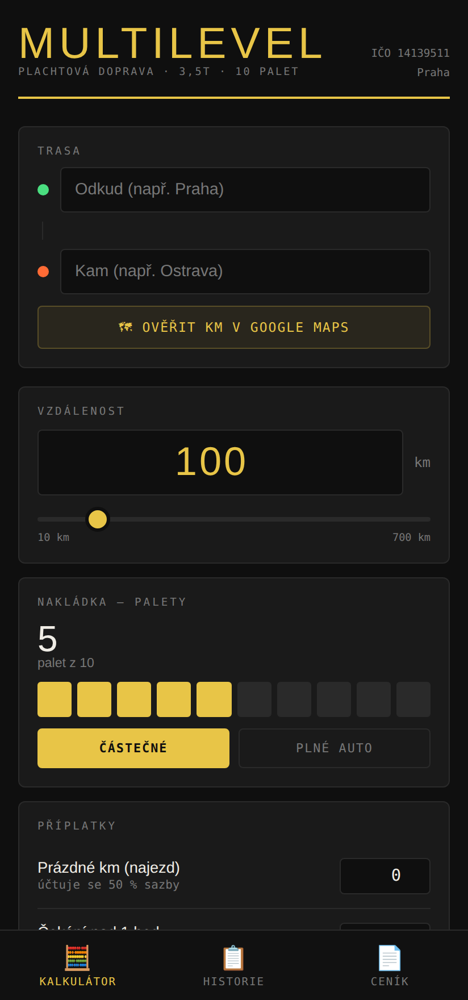
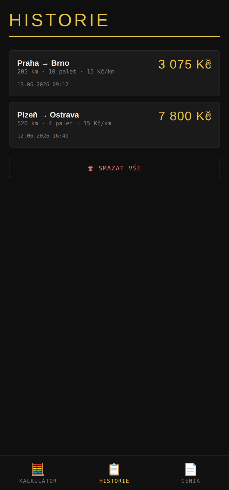
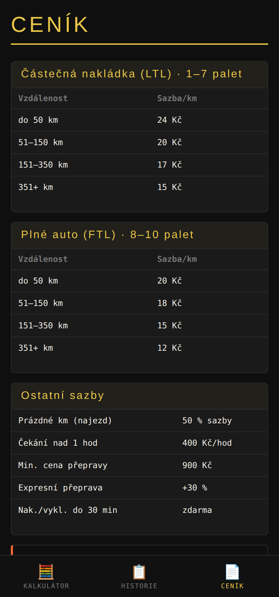

<div align="center">


# Multilevel Doprava

**Kalkulačka ceny dopravy** — plachtová doprava 3,5 t · 10 palet
Mobilní webová appka (PWA), kterou jde nainstalovat na telefon a používat i offline.

</div>

---

## Co to je

Jednoduchá kalkulačka pro rychlý výpočet ceny přepravy. Zadáš trasu a vzdálenost,
počet palet a případné příplatky — appka spočítá cenu podle ceníku a umí ji rovnou
**zkopírovat jako nabídku zákazníkovi**. Všechno běží v prohlížeči, nepotřebuje
server ani připojení k internetu.

## Náhled

| Kalkulátor | Historie | Ceník |
|:---:|:---:|:---:|
|  |  |  |

## Funkce

- 🧮 **Kalkulátor** — vzdálenost (pole + posuvník), počet palet (1–10), přepínač
  *částečná nakládka (LTL) / plné auto (FTL)*.
- 💸 **Automatická sazba** podle ceníku (km × vytíženost), nebo vlastní sazba /
  rychlá tlačítka (12–24 Kč).
- ➕ **Příplatky** — prázdné km (najezd, 50 % sazby), čekání (400 Kč/hod),
  mýtné/extra. Hlídá se **minimální cena 900 Kč**.
- 🗺 **Ověření km v Google Maps** — otevře trasu „odkud → kam".
- 📋 **Kopírovat zákazníkovi** — hotová textová nabídka do schránky.
- 💾 **Historie** — posledních 50 výpočtů, uloženo v telefonu (localStorage).
- 📄 **Ceník** — přehled všech sazeb.
- 📲 **PWA** — jde nainstalovat na plochu (Android i iPhone) a funguje offline.

## Jak si to zobrazit / vyzkoušet lokálně

PWA potřebuje běžet přes `http://` (ne otevřít soubor přímo), aby fungoval service
worker. Stačí spustit jednoduchý lokální server ve složce projektu:

```bash
# Varianta A — Python (většinou je předinstalovaný)
python3 -m http.server 8080

# Varianta B — Node
npx serve .
```

Potom otevři v prohlížeči **http://localhost:8080**.
Na telefonu otevři stejnou adresu, jen místo `localhost` použij IP adresu počítače
(např. `http://192.168.0.10:8080`) — telefon musí být na stejné Wi-Fi.

## Jak to ukázat ostatním (veřejný odkaz)

Nejjednodušší je **GitHub Pages** — zdarma, dostaneš veřejnou adresu, kterou pošleš
komukoliv a jde z ní appku rovnou nainstalovat na telefon:

1. V repozitáři otevři **Settings → Pages**.
2. U *Build and deployment* zvol **Source: GitHub Actions**.
3. Hotovo — po pushnutí do větve se appka sama nasadí (workflow je v
   `.github/workflows/pages.yml`) a poběží na adrese
   `https://galexandr95-lab.github.io/multilevel/`.

## Struktura projektu

```
multilevel/
├── index.html          # celá aplikace (HTML + CSS + JS v jednom souboru)
├── manifest.json       # PWA manifest (název, barvy, ikony)
├── sw.js               # service worker (offline cache)
├── icon.svg            # zdrojová ikona (vektor)
├── icon-192.png        # ikona pro Android / PWA
├── icon-512.png        # ikona pro Android / PWA
├── apple-touch-icon.png# ikona pro iPhone (plocha)
├── screenshots/        # náhledy pro tento README
└── .github/workflows/  # automatické nasazení na GitHub Pages
```

## Ceník (sazby v aplikaci)

**Částečná nakládka (LTL) · 1–7 palet**

| Vzdálenost | Sazba/km |
|---|---|
| do 50 km | 24 Kč |
| 51–150 km | 20 Kč |
| 151–350 km | 17 Kč |
| 351+ km | 15 Kč |

**Plné auto (FTL) · 8–10 palet**

| Vzdálenost | Sazba/km |
|---|---|
| do 50 km | 20 Kč |
| 51–150 km | 18 Kč |
| 151–350 km | 15 Kč |
| 351+ km | 12 Kč |

**Ostatní:** prázdné km = 50 % sazby · čekání nad 1 hod = 400 Kč/hod ·
min. cena přepravy = 900 Kč · expresní +30 %.

> Sazby jsou napsané přímo v `index.html` (funkce `getAutoRate`) — kdyby ses
> rozhodl je měnit, stačí upravit čísla tam a v sekci *Ceník*.

---

<div align="center">
<sub>Multilevel s.r.o. · IČO 14139511 · Praha · ceny bez DPH (neplátce DPH)</sub>
</div>
